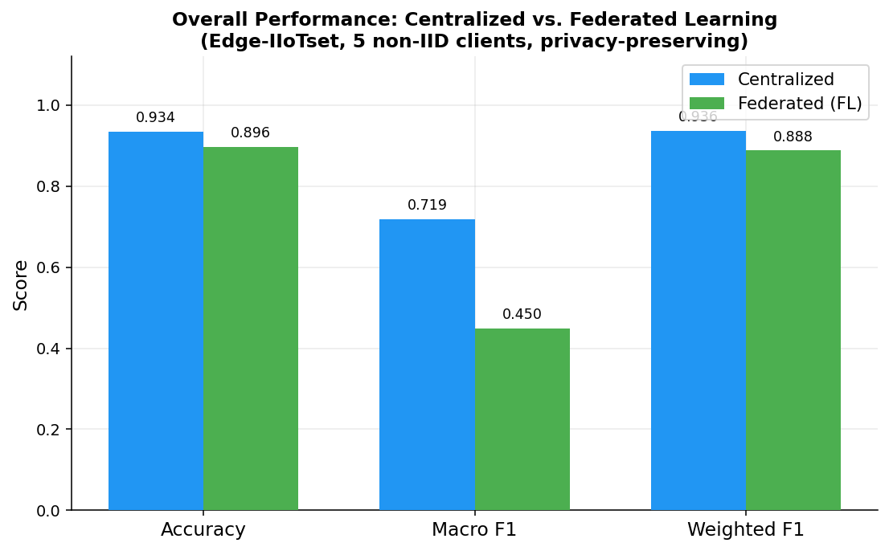
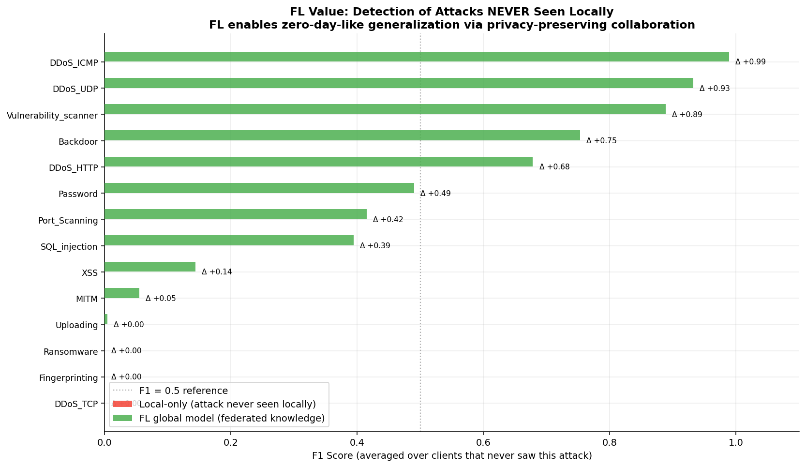
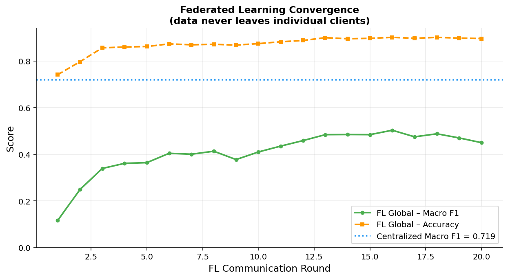
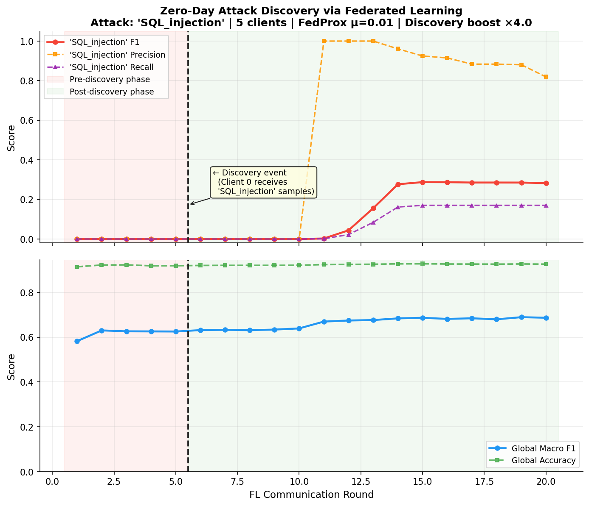
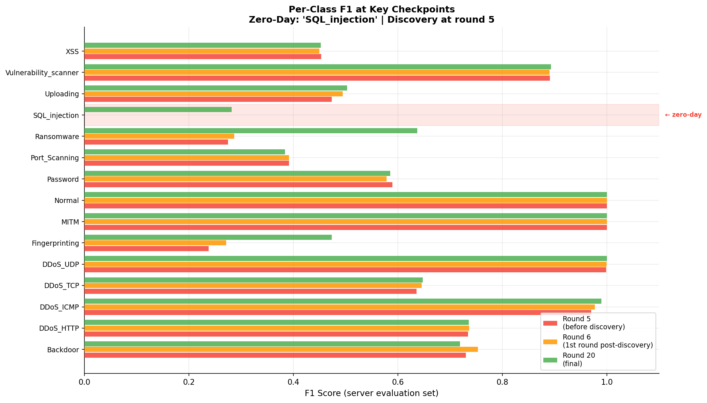
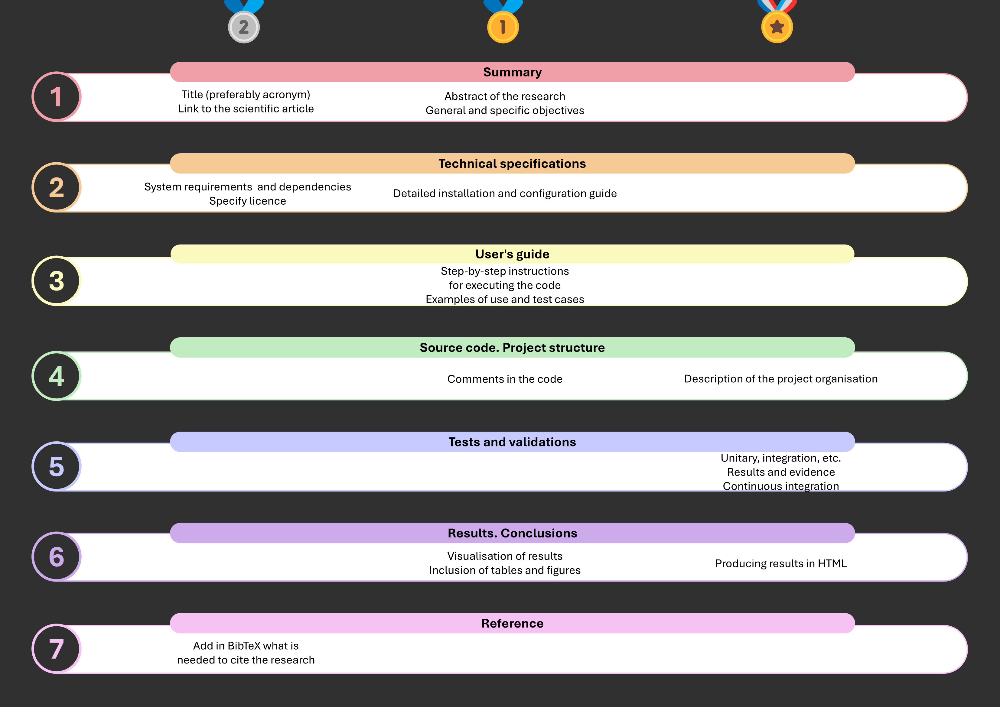

# FL Demo — Federated Learning for Cybersecurity (IDS)

[](https://github.com/Telefonica-Scientific-Research/FL_Demo_Cyber/actions/workflows/main.yml)

A self-contained demonstration of how **Federated Learning (FL)** improves
Intrusion Detection Systems (IDS) in realistic network environments, using the
[Edge-IIoTset](https://www.kaggle.com/datasets/mohamedamineferrag/edgeiiotset-cyber-security-dataset-of-iot-iiot)
dataset (2.2 M rows, 15 attack classes, 5 IoT/IIoT threat categories).

Three experiments are included:

| # | Experiment | Key finding |
|---|------------|-------------|
| 1 | Centralized baseline | Accuracy 93.4 %, Macro F1 0.72 |
| 2 | Federated (non-IID, FedProx) | Accuracy 89.6 %, Macro F1 0.45 — clients with **no local exposure** to an attack gain +0.40 F1 from federation |
| 3 | Zero-day discovery via FL | A single client discovering a new attack propagates its knowledge to the entire network within **~8 FL rounds** |

---

## Description

Modern enterprise networks span multiple administrative domains (ISPs, data
centres, IoT fleets) that cannot share raw traffic data for legal or competitive
reasons. Federated Learning allows each domain to contribute model updates
**without ever exposing local packets**, while the global aggregated model
benefits from the collective threat intelligence of all participants.

This demo quantifies that benefit on a real-world IoT intrusion dataset:

### Experiment 1 — Centralized IDS

A Deep Neural Network trained on the full dataset (centralised). Serves as the
oracle upper-bound.

- **DNN architecture**: Linear(88→256) → BN → ReLU → Dropout(0.3) → … →
  Linear(64→15)
- **Training**: 20 epochs, Adam, CosineAnnealingLR, class-weighted
  CrossEntropyLoss

<p align="center">

</p>
<p align="center"><em>Fig. 1. Overall accuracy and F1 — centralised baseline vs FL global model.</em></p>

### Experiment 2 — Federated IDS (FedProx, non-IID)

Five clients each hold traffic from a subset of the five IoT threat categories
(DoS/DDoS, Recon, Injection, MITM, Malware). No client sees all attack types.
Federation with **FedAvg + FedProx** (μ=0.01) is run for 20 rounds.

<p align="center">

</p>
<p align="center"><em>Fig. 2. Per-client F1 on attacks never seen locally — before (local-only) and after (FL global model) federation. Mean improvement: +0.40.</em></p>

<p align="center">

</p>
<p align="center"><em>Fig. 3. Global model convergence over 20 FL communication rounds.</em></p>

### Experiment 3 — Zero-Day Attack Discovery

All clients train without exposure to one designated "zero-day" attack
(`SQL_injection`). A **server-side evaluation set** (10 % of data, all classes)
monitors the global model's zero-day F1 after each round. At round 5 one
client discovers the zero-day and begins including those samples in local
training — **without any out-of-band alert to the server**.

<p align="center">

</p>
<p align="center"><em>Fig. 4. Zero-day (SQL_injection) F1 on the server evaluation set per FL round. The dashed vertical line marks the discovery event. F1 rises from 0 → 0.28 in ~8 rounds.</em></p>

<p align="center">

</p>
<p align="center"><em>Fig. 5. Per-class F1 before discovery (round 5), one round after (round 6), and at the end (round 20). Knowledge of the zero-day propagates without degrading detection of known attacks.</em></p>

---

## Results summary

### Experiment 1 & 2

| Metric | Centralized | Federated (global) |
|--------|-------------|-------------------|
| Accuracy | **0.9337** | 0.8962 |
| Macro F1 | **0.7186** | 0.4495 |
| Weighted F1 | **0.9363** | 0.8962 |
| Δ F1 on unseen attacks | — | **+0.40** |

### Experiment 3 — Zero-day propagation

| Round | Phase | `SQL_injection` F1 |
|-------|-------|--------------------|
| 1–5 | Pre-discovery | 0.000 |
| 6–10 | Post-discovery (gestation) | 0.000 |
| 11 | Post-discovery | 0.003 |
| 13 | Post-discovery | 0.156 |
| 14–20 | Post-discovery | **~0.28** |

---

## Repository structure

```
FL-Demo/
├── Scripts/
│   ├── download_data.py        # Kaggle dataset downloader (extensible registry)
│   ├── preprocess.py           # Shared preprocessing + non-IID FL partitioning
│   ├── models.py               # DNN architecture (IntrusionDetectionDNN)
│   ├── train_centralized.py    # Experiment 1: centralised IDS
│   ├── train_federated.py      # Experiment 2: FedAvg + FedProx
│   ├── train_fl_new_attack.py  # Experiment 3: zero-day discovery scenario
│   ├── compare.py              # Figures 01–05 (centralised vs FL comparison)
│   └── run_experiment.py       # End-to-end pipeline orchestrator
├── Results/
│   ├── centralized_results.json
│   ├── federated_results.json
│   ├── new_attack_results.json
│   └── figures/                # All generated figures (01–07)
├── Data/                       # Downloaded dataset (not tracked in git)
│   └── EdgeIIoTset/
│       └── DNN-EdgeIIoT-dataset.csv   # 2.2 M rows, ~1.1 GB
└── requirements.txt
```

---

## How to reproduce

### 1. Install dependencies

```bash
pip install -r requirements.txt
```

### 2. Download the dataset

Requires a [Kaggle API token](https://www.kaggle.com/docs/api) at `~/.kaggle/kaggle.json`.

```bash
python Scripts/download_data.py --dataset edge_iiotset
```

### 3. Run all experiments

```bash
# Full pipeline (centralised + federated comparison)
python Scripts/run_experiment.py --sample-frac 0.3 --rounds 20 --local-epochs 2 --mu 0.01

# Zero-day discovery scenario
python Scripts/train_fl_new_attack.py \
    --zero-day-attack SQL_injection \
    --discovery-round 5 \
    --discovery-boost 4 \
    --rounds 20 --local-epochs 2 --n-clients 5 --sample-frac 0.3
```

### 4. Generate comparison figures

```bash
python Scripts/compare.py
```

All figures are saved to `Results/figures/`.

---

## Dataset

**Edge-IIoTset** — A realistic IoT/IIoT cybersecurity dataset collected from a
purpose-built testbed with 10 IoT/IIoT devices and 14 distinct attack types
across 5 categories:

| Category | Attacks |
|----------|---------|
| DoS/DDoS | DDoS_HTTP, DDoS_ICMP, DDoS_TCP, DDoS_UDP |
| Recon | Fingerprinting, Port_Scanning, Vulnerability_scanner |
| Injection | SQL_injection, XSS, Uploading |
| MITM | MITM |
| Malware | Backdoor, Password, Ransomware |

> M.A. Ferrag et al., "Edge-IIoTset: A New Comprehensive Realistic Cyber Security Dataset of IoT and IIoT Applications for Centralized and Federated Learning," *IEEE Access*, 2022.

---

## Requirements

```
kaggle>=1.6.0
torch>=2.0.0
scikit-learn>=1.3.0
pandas>=2.0.0
numpy>=1.24.0
matplotlib>=3.7.0
seaborn>=0.12.0
tqdm>=4.65.0
```

Python 3.10+ recommended. Runs on CPU (MPS/CUDA automatically used if available).

---

## Citation

If you use this code or reproduce these experiments, please cite:

```bibtex
@misc{fldemo_cyber_2026,
  title   = {Federated Learning for Cybersecurity -- IDS Demo on Edge-IIoTset},
  author  = {Solans, David},
  year    = {2026},
  url     = {https://github.com/Telefonica-Scientific-Research/FL_Demo_Cyber}
}
```


### HOW TO USE THIS TEMPLATE

> **DO NOT FORK** this is meant to be used from **[Use this template](https://github.com/maviva/python-project-silver-template/generate)** feature.

1. Click on **[Use this template](https://github.com/maviva/python-project-silver-template/generate)**
3. Give a name to your project  
   (e.g. `my_awesome_project` recommendation is to use all lowercase and underscores separation for repo names.)
3. Wait until the first run of CI finishes  
   (Github Actions will process the template and commit to your new repo)
4. If you want [codecov](https://about.codecov.io/sign-up/) Reports and Automatic Release to [PyPI](https://pypi.org)  
  On the new repository `settings->secrets` add your `PYPI_API_TOKEN` and `CODECOV_TOKEN` (get the tokens on respective websites)
4. Read the file [CONTRIBUTING.md](CONTRIBUTING.md)
5. Then clone your new project and happy coding!

> **NOTE**: **WAIT** until first CI run on github actions before cloning your new project.

### What is included on this template?

- 📦 A basic [setup.py](setup.py) file to provide installation, packaging and distribution for your project.  
  Template uses setuptools because it's the de-facto standard for Python packages, you can run `make switch-to-poetry` later if you want.
- 🤖 A [Makefile](Makefile) with the most useful commands to install, test, lint, format and release your project.
- 📃 Documentation structure using [mkdocs](http://www.mkdocs.org)
- 💬 Auto generation of change log using **gitchangelog** to keep a HISTORY.md file automatically based on your commit history on every release.
- 🐋 A simple [Containerfile](Containerfile) to build a container image for your project.  
  `Containerfile` is a more open standard for building container images than Dockerfile, you can use buildah or docker with this file.
- 🧪 Testing structure using [pytest](https://docs.pytest.org/en/latest/)
- ✅ Code linting using [flake8](https://flake8.pycqa.org/en/latest/)
- 📊 Code coverage reports using [codecov](https://about.codecov.io/sign-up/)
- 🛳️ Automatic release to [PyPI](https://pypi.org) using [twine](https://twine.readthedocs.io/en/latest/) and github actions.
- 🎯 Entry points to execute your program using `python -m <fl_demo_cyber>` or `$ fl_demo_cyber` with basic CLI argument parsing.
- 🔄 Continuous integration using [Github Actions](.github/workflows/) with jobs to lint, test and release your project on Linux, Mac and Windows environments.

### Repository quality

<p align="center">

</p>


<!--  DELETE THE LINES ABOVE THIS AND WRITE YOUR PROJECT README BELOW -->

---
# fl_demo_cyber

[](https://codecov.io/gh/Telefonica-Scientific-Research/FL_Demo_Cyber)
[](https://github.com/Telefonica-Scientific-Research/FL_Demo_Cyber/actions/workflows/main.yml)

Brief abstract of the research
[_"Title"_](https://journal.net/forum?id=Title)


## Description

Description

<p align="center">

</p>
<p align="center">
Fig. 1. Caption 1
</p>


### Subsection

Description


## Results

Main Results

<table style="border-collapse: collapse; width: 100%; height: 108px;" align="center">
   <thead>
      <tr style="height: 18px;">
         <td style="width: 20%; height: 18px; text-align: center;" align="center"><strong>Dataset</strong></td>
         <td style="width: 20%; height: 18px; text-align: center;" align="center"><strong>Rows</strong></td>
         <td style="width: 20%; height: 18px; text-align: center;" align="center"><strong>Num. Feats</strong></td>
         <td style="width: 20%; height: 18px; text-align: center;" align="center"><strong>Cat. Feats</strong></td>
         <td style="width: 20%; height: 18px; text-align: center;" align="center"><strong>Task</strong></td>
      </tr>
   </thead>
   <tbody>
      <tr style="height: 18px;">
         <td style="width: 20%; height: 18px; text-align: center;" align="center"><a href="https://community.fico.com/s/explainable-machine-learning-challenge">HELOC</a></td>
         <td style="width: 20%; height: 18px; text-align: center;" align="center">9871</td>
         <td style="width: 20%; height: 18px; text-align: center;" align="center">21</td>
         <td style="width: 20%; height: 18px; text-align: center;" align="center">2</td>
         <td style="width: 20%; height: 18px; text-align: center;" align="center">Binary</td>
      </tr>
   </tbody>
</table>


## How to use the code

### Install it from PyPI

```bash
pip install fl_demo_cyber
```

### Usage

```py
from fl_demo_cyber import BaseClass
from fl_demo_cyber import base_function

BaseClass().base_method()
base_function()
```

```bash
$ python -m fl_demo_cyber
#or
$ fl_demo_cyber
```


### Requirements

```bash
numpy==1.25.2
pandas==2.1.0
scikit-learn==1.1.2
tqdm==4.64.1
torch==1.13.0+cu117
torch-geometric==2.2.0
xgboost==1.7.2
```


## Citation

If you use this codebase, please cite our work:

```bib
@article{authorYearTitle,
    title={title},
    author={author},
    year={year},
    journal={journal},
    url={url}
}
```
